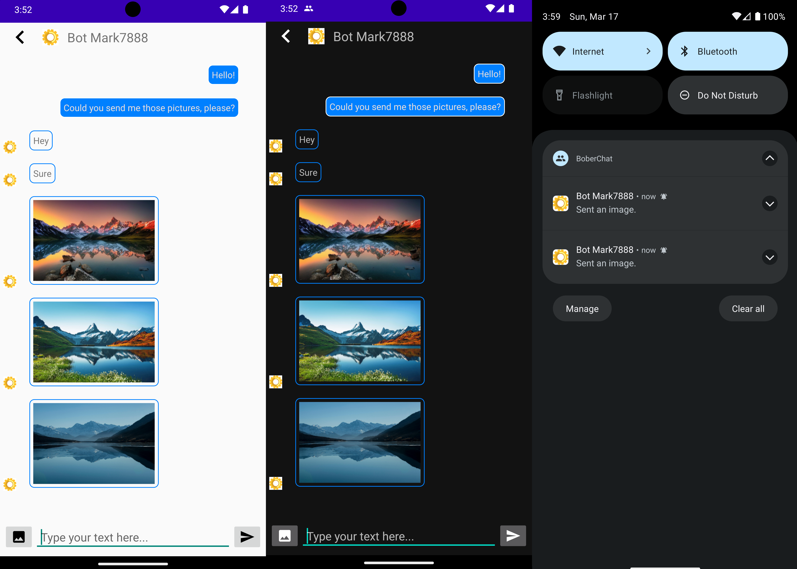

# Bober Chat

## Introduction
Welcome to the README for the Android chat application developed for the complex assignment for 'Mobile Programing' university course. This application is designed to facilitate real-time communication between users through text and image messages. It leverages Kotlin for Android development, Firebase for Google authentication and real-time messaging, and MariaDB for database management. The backend server is implemented in Python.

## Features
- **Google Authentication**: Users can authenticate using their Google accounts through Firebase authentication.
- **Real-time Messaging**: Utilizes Firebase Cloud Messaging for efficient real-time message receiving.
- **Text and Image Messages**: Users can send both text and image messages. Images can be selected from the device gallery.
- **Real-time Notifications**: The application sends out real-time notifications for new messages. Users can click on notifications to open the chat directly.
- **Email Address as Usernames**: Usernames are based on email addresses, enabling users to send messages to specific email addresses.
- **Search Functionality**: Users can search among their chat partners to quickly find and access conversations.
- **Responsive Design**: The application features responsive design with both light and dark modes for enhanced user experience.

## Example Screenshot


## Server Repository
For backend functionalities and server setup, please refer to my [Python backend server repository](https://github.com/Mark7888/bober-chat-server).

## Setup
Before building and running the Android application, follow these setup steps:

1. **Firebase Configuration**:
   - Create a Firebase project in the [Firebase Console](https://console.firebase.google.com/).
   - Set up Google login authentication in Firebase for your project.
   - Download the `google-services.json` file from Firebase and place it in the `app/` directory of your Android project.

2. **Gradle Signing Report**:
   - Run the Gradle signing report script to obtain the SHA-1 hash for your application:
     ```
     ./gradlew signingReport
     ```
   - Copy the SHA-1 hash from the output.

3. **Firebase Configuration Continued**:
   - In the Firebase Console, navigate to your project's settings.
   - Add the obtained SHA-1 hash to your project's settings in Firebase.

4. **Domain Configuration**:
   - Update the domain name or server URL in the (ConnectionHandler.kt)[https://github.com/Mark7888/bober-chat-client/blob/master/app/src/main/java/me/mark7888/boberchat/ConnectionHandler.kt#L18] file to point to your server's domain.

5. **Building and Running**:
   - Build and run the Android application using Android Studio or the command line.

## Usage
Once the Android application is set up and running, users can perform the following actions:
- Authenticate using their Google account credentials.
- Send text and image messages to their chat partners.
- Receive real-time notifications for incoming messages.
- Search among their chat partners to quickly find and access conversations.

## Dependencies
- Kotlin
- Firebase Authentication
- Firebase Cloud Messaging
- MariaDB
- Android Studio

## Issues and Support
For any issues or support requests, please open an issue in the GitHub repository.

## License
This project is licensed under the [MIT License](LICENSE).
